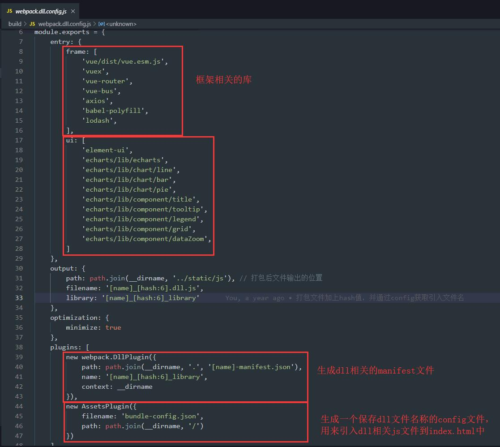
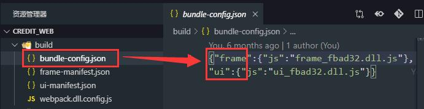
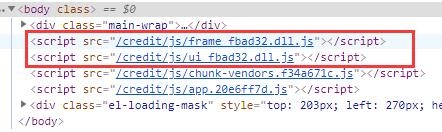

?> 作者：拂晓，供稿日期：2019/11/22

## 遇到的问题

在用 webpack 打包的时候，如果我们按照官方的默认配置进行，并且我们项目比较庞大，就会出现打包一次会花费好几分钟时间的等待。

究其原因，主要是因为一些第三方的框架库比较大，比如 react、vue、element-ui、echarts、lodash 等等。

由于第三方库不是经常需要更新的，我们有没有办法把这些第三方库先单独打包出来预存着呢？

## 解决方案

-   CommonsChunkPlugin
-   DLLPlugin

### CommonsChunkPlugin

webpack 每次打包实际还是需要去处理这些第三方库，只是打包完之后，能把第三方库和我们自己的代码分开。打包时间并没有节省。

### DLLPlugin

能把第三方代码完全分离开。打包好 dll 后，之后每次只会打包项目自身的代码，打包效率会有一定的提升。

Dll 这个概念是借鉴了 Windows 系统的 dll（Dynamic Link Library）。一个 dll 包，就是一个单纯的依赖库，它本身不能运行，是用来给你的 app 进行引用的。

## 项目实战

### 项目目录结构

### webpack.dll.config.js 相关配置

### 生成 dll 的操作步骤

-   在 package.json 文件中添加打包 dll 的代码

    

-   执行打包命令：npm run dll

    -   会在 output 指定的目录中生成对应的 dll.js 文件

        

    -   会在 build 目录下生成 bundle-config.json 文件用来保存当前 dll.js 的文件名（包含 hash 值）

        

    -   会在 build 目录下生成 2 个 manifest.json 文件，分别是 frame 和 ui 的。

        manifest.json 文件主要是记录第三方库的索引，在之后进行项目打包的时候，会通过 manifest.json 文件来排除相关的三方库，并且在项目运行时通过索引直接获取到提前预加载的第三方库 dll.js 对外暴露的方法，完成源码的引用加载。

        

### 如何将 dll 文件引入到 index.html 中

-   通过 bundle-config.json 文件获取到生成的 dll 文件名，拼入到相关的 dll.js 的路径里

    

    

    

-   配置 vue.config.js

    -   通过使用 DllReferencePlugin 在项目打包的时候引用 manifest 索引里的第三方库。

    -   通过使用 AddAssetHtmlPlugin 将 dll 相关 js 动态引入到 index.html 中

        

### 项目打包流程

-   只需运行一次 npm run dll 打包相关的第三方框架库
-   之后每次只需要运行 npm run build 即可

PS： 进行第三方框架更新后，需要重新运行一次 npm run dll 更新 dll 文件

打包优化后，50 page + 20 component 打包速度可以控制在 30s-100s 的水平（时间差异主要因为 webpack 开启了 cache-loader）

## 参考资料

https://webpack.js.org/plugins/dll-plugin/#dllplugin
