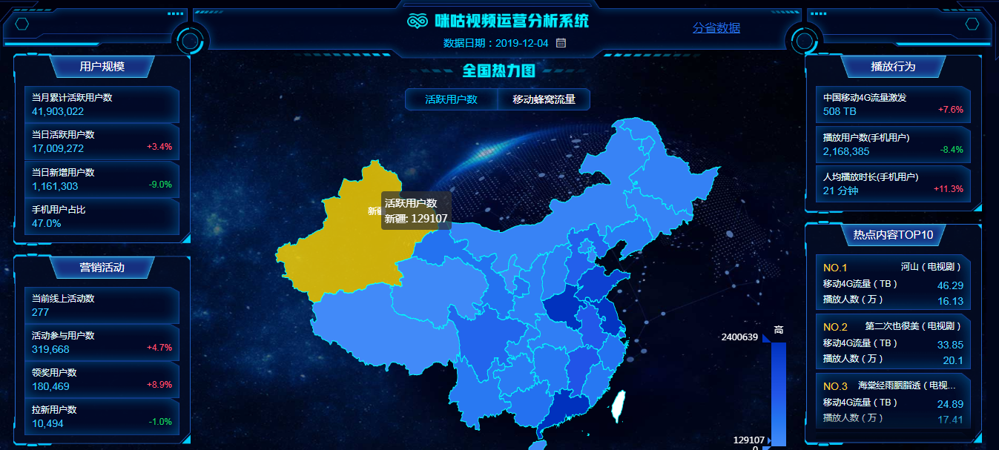

?> 作者：Lucas ，供稿日期：2019/12/06


## 概要

在 Vue2.0 中，代码复用和抽象的主要形式是组件。然而，有的情况下，你仍然需要对普通 DOM 元素进行底层操作，这时候就会用到自定义指令。

例如，当页面加载完成时让某个输入框获得焦点（注意：`autofocus` 在移动版 Safari 上不工作），我们可以注册一个全局指令：
```javascript
// 注册一个全局自定义指令 `v-focus`
Vue.directive('focus', {
  // 当被绑定的元素插入到 DOM 中时……
  inserted: function (el) {
    // 聚焦元素
    el.focus()
  }
})
```

或者在vue页面中注册一个局部的指令：
```javascript
directives: {
  focus: {
    // 指令的定义
    inserted: function (el) {
      el.focus()
    }
  }
}
```

模板中使用`<input v-focus>`即可。

## Directive hooks
一个指令定义对象可以提供如下几个钩子函数 (均为可选)：
- `bind`：只调用一次，指令第一次绑定到元素时调用。在这里可以进行一次性的初始化设置。
- `inserted`：被绑定元素插入父节点时调用 (仅保证父节点存在，但不一定已被插入文档中)。
- `update`：所在组件的 VNode 更新时调用，但是可能发生在其子 VNode 更新之前。指令的值可能发生了改变，也可能没有。但是你可以通过比较更新前后的值来忽略不必要的模板更新。
- `componentUpdated`：指令所在组件的 VNode 及其子 VNode 全部更新后调用。
- `unbind`：只调用一次，指令与元素解绑时调用。

指令钩子函数会被传入以下参数：
- `el`：指令所绑定的元素，可以用来直接操作 DOM 。
- `binding`：一个对象，包含以下属性：
  - `name`：指令名，不包括 v- 前缀。
  - `value`：指令的绑定值，例如：v-my-directive="1 + 1" 中，绑定值为 2。
  - `oldValue`：指令绑定的前一个值，仅在 update 和 componentUpdated 钩子中可用。无论值是否改变都可用。
  - `expression`：字符串形式的指令表达式。例如 v-my-directive="1 + 1" 中，表达式为 "1 + 1"。
  - `arg`：传给指令的参数，可选。例如 v-my-directive:foo 中，参数为 "foo"。
  - `modifiers`：一个包含修饰符的对象。例如：v-my-directive.foo.bar 中，修饰符对象为 { foo: true, bar: true }。
- `vnode`：Vue 编译生成的虚拟节点。移步 VNode API 来了解更多详情。
- `oldVnode`：上一个虚拟节点，仅在 update 和 componentUpdated 钩子中可用。

## Demo



npm上已实现其功能的有`vue-count-to`组件
```html
<template>
  <countTo :startVal='startVal' :endVal='endVal' :duration='3000'></countTo>
</template>
```
优点是：组件化、功能比较全面
缺点是：引入包的体积较大、页面中会引入组件的DOM节点

### 自定义指令
目的：创建一个轻量级的`count-to`指令，在不引入外部节点的情形下可以在任何DOM节点上实现其基本功能。

代码实现：
[main.js](https://github.com/LucasZheng/vue-directive-count-to/blob/master/main.js)

```javascript
const DURATION = 3000

const formatNumber = (num) => {
  let number = num.toFixed(0)
  const rgx = /(\d+)(\d{3})/
  while (rgx.test(number)) {
    number = number.replace(rgx, '$1' + ',' + '$2')
  }
  return number
}

const countTo = (() => {
  const initDom = (el, binding) => {
    el.innerHTML = ''
    if (!binding.value || isNaN(binding.value)) {
      el.innerHTML = binding.value
      return false
    }
    return true
  }
  const countNum = (el, binding) => {
    let startTime
    let duration = DURATION

    const arg = binding.arg
    const modifiers = binding.modifiers
    const modifiersArr = Object.keys(modifiers)
    if ((arg && arg === 'time') && modifiersArr.length) {
      duration = isNaN(modifiersArr[0]) ? DURATION : parseInt(modifiersArr[0])
    }

    const count = (timestamp) => {
      if (!startTime) {
        startTime = timestamp
      }
      const progress = timestamp - startTime
      const printVal = binding.value * Math.min((progress / duration).toFixed(2), 1)
      el.innerHTML = formatNumber(printVal)
      if (progress < duration) {
        requestAnimationFrame(count)
      }
    }
    requestAnimationFrame(count)
  }
  const handleCount = (el, binding) => {
    if (!initDom(el, binding)) {
      return
    }
    countNum(el, binding)
  }

  return {
    bind (el, binding) {
      handleCount(el, binding)
    },
    update (el, binding) {
      if (binding.value !== binding.oldValue) {
        handleCount(el, binding)
      }
    }
  }
})()

export default countTo
```

## npm包发布
webpack打包，`libraryTarget: "umd"` 可以用任何一种引入方式，即支持cmd，amd，及全局。
```javascript
module.exports = {
  mode: 'production',
  entry: './main.js',
  output: {
    filename: 'bundle.js',
    libraryTarget: "umd"
  }
}
```

`package.json`定义:
```json
{
  "name": "vue-directive-count-to",
  "description": "A custom directive of countTo for VUE.",
  "version": "1.0.1",
  "main": "dist/bundle.js",
  "repository": {
    "type": "git",
    "url": "https://github.com/LucasZheng/vue-directive-count-to.git"
  },
  "keywords": [
    "count-to",
    "countTo",
    "vue-count-to",
    "vue-directive"
  ],
  "author": "LucasZheng",
  "license": "MIT",
  "homepage": "https://github.com/LucasZheng/vue-directive-count-to.git",
  "bugs": {
    "url": "https://github.com/LucasZheng/vue-directive-count-to/issues"
  },
  "scripts": {
    "build": "webpack"
  },
  "devDependencies": {
    "webpack": "^4.41.2",
    "webpack-cli": "^3.3.10"
  }
}
```

执行`npm run build` 后就生成了`dist/bundle.js`文件。

在[npm官网](https://www.npmjs.com/)注册自己的账号，然后执行`npm login`和`npm publish`即可。
查看是否发布成功：[vue-directive-count-to](https://www.npmjs.com/package/vue-directive-count-to)

注意事项：
- npm 包删除后必须等24小时才能再发布
- 可以通过更新版本号来重新发布npm包


