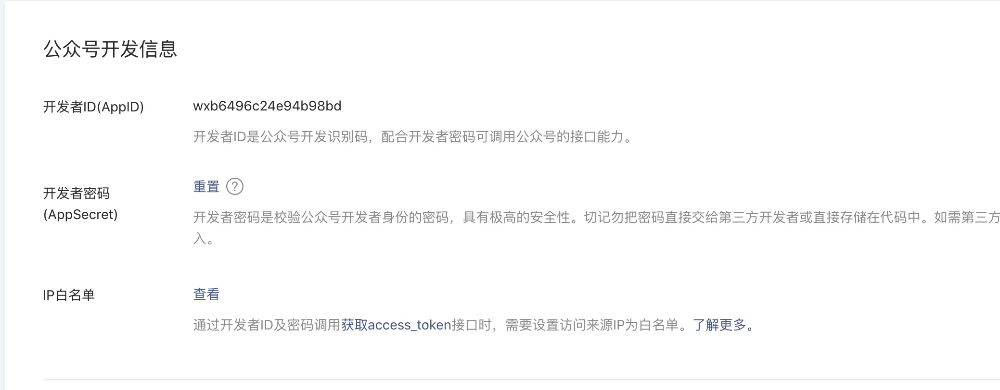
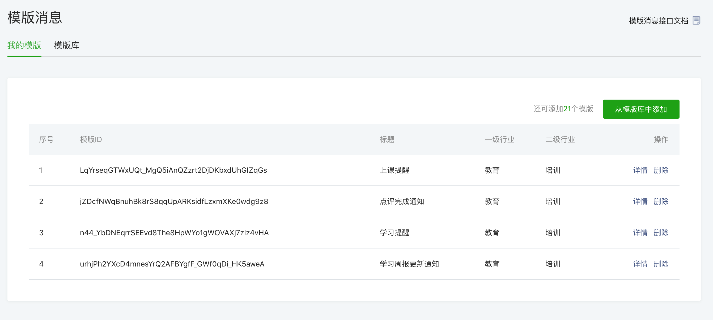
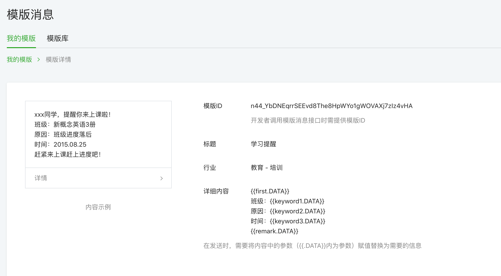

?> 作者：石头 ，供稿日期：2019/07/26


## 公众号推送

### 简介

微信公众号提供了接口方便进行消息推送。只要用户关注了对应的**服务号**， 就可以对其进行消息推送。推送的消息，支持打开网页或者打开小程序。

!> 公众号推送只针对服务号，普通个人公众号是不支持推送的。必须通过认证（花钱了）才可以调用推送接口


### 生成密钥


为了方便调用推送接口，需要先生成密钥，也就是`AppID`和`AppSecret`，前往“开发 -> 基本配置” 中生成 `AppSecret`。


!> 注意`AppSecret`生成后需要手动保存起来，后续是没法在微信后台进行查看的。



### 生成 ACCESS_TOKEN

在调用推送接口之前，需要先生成一个`ACCESS_TOKEN`。可以将其理解为用户登入。通过之前的`AppID`和`AppSecret`可以换取`ACCESS_TOKEN`

只需要往 `https://api.weixin.qq.com/cgi-bin/token?grant_type=client_credential&appid=AppID&secret=AppSecret`发送一个`GET`请求，就可以获取`ACCESS_TOKEN`。相应如下：

```json
{
    "access_token": "23_ut_jOdU43FNnaEtNm_9SJx...",
    "expires_in": 7200
}
```

### 生成模板

微信推模板送都由一定的格式，这个格式叫做模板。可以访问微信后台的“功能 -> 模板消息”来创建模板，模板创建后，会生成一个模板 ID，这个模板 ID 会在推送接口里面用到。





### 消息推送

推送接口可以参考[微信官方文档](https://mp.weixin.qq.com/wiki?t=resource/res_main&id=mp1433751277)。

简单来说，就是往`https://api.weixin.qq.com/cgi-bin/message/template/send?access_token=ACCESS_TOKEN`发送 POST 请求，请求参数如下所示：

| 参数        | 是否必填 | 说明                                                                                                  |
| ----------- | -------- | ----------------------------------------------------------------------------------------------------- |
| touser      | 是       | 接收者 openid                                                                                         |
| template_id | 是       | 模板 ID                                                                                               |
| url         | 否       | 模板跳转链接（海外帐号没有跳转能力）                                                                  |
| miniprogram | 否       | 跳小程序所需数据，不需跳小程序可不用传该数据                                                          |
| appid       | 是       | 所需跳转到的小程序 appid（该小程序 appid 必须与发模板消息的公众号是绑定关联关系，暂不支持小游戏）     |
| pagepath    | 否       | 所需跳转到小程序的具体页面路径，支持带参数,（示例 index?foo=bar），要求该小程序已发布，暂不支持小游戏 |
| data        | 是       | 模板数据                                                                                              |
| color       | 否       | 模板内容字体颜色，不填默认为黑色                                                                      |

推送 URL 传递 json 如下：

```json
{
    "touser": "o_rbq1TOgERuflYd7PsiE9H565Oo",
    "template_id": "n44_YbDNEqrrSEEvd8The8HpWYo1gWOVAXj7zIz4vHA",
    "url": "http://www.baidu.com",
    "data": {
        "remark": {
            "value": "不积跬步无以至千里，加油！"
        },
        "keyword3": {
            "value": "2019-06-09"
        },
        "first": {
            "value": "石头同学，提醒您背单词啦"
        },
        "keyword1": {
            "value": "巅峰单词800个背诵"
        },
        "keyword2": {
            "value": "今日背诵单词任务未完成"
        }
    }
}
```

推送小程序传递 json 如下：

```json
{
    "touser": "o_rbq1TOgERuflYd7PsiE9H565Oo",
    "template_id": "n44_YbDNEqrrSEEvd8The8HpWYo1gWOVAXj7zIz4vHA",
    "miniprogram": {
        "appid": "wx2210554e092c3f99",
        "pagepath": "pages/index/index"
    },
    "data": {
        "remark": {
            "value": "不积跬步无以至千里，加油！"
        },
        "keyword3": {
            "value": "2019-06-09"
        },
        "first": {
            "value": "石头同学，提醒您背单词啦"
        },
        "keyword1": {
            "value": "巅峰单词800个背诵"
        },
        "keyword2": {
            "value": "今日背诵单词任务未完成"
        }
    }
}
```

## 小程序推送

### 简介

和公众号类似， 小程序支持给用户下发服务通知。

!> 必须通过认证（花钱了）才可以调用推送接口。


### 生成密钥

和微信公众号类似，需要先生成密钥，也就是`AppID`和`AppSecret`，前往“开发 -> 开发设置” 中生成 AppSecret。主要 AppSecret 生成后需要保存起来，后续是没法在微信后台进行查看的。

### 生成 ACCESS_TOKEN

和公众号一样，也是往`https://api.weixin.qq.com/cgi-bin/token?grant_type=client_credential&appid=AppID&secret=AppSecret`发送一个`GET`请求，就可以获取`ACCESS_TOKEN`。

### 生成模板

和公众号类似， 小程序推送也需要模板。需要前往“功能 -> 模板消息”中生成模板

### 消息推送

推送接口可以参考[微信官方文档](https://developers.weixin.qq.com/miniprogram/dev/api-backend/open-api/template-message/templateMessage.send.html)。

简单来说，就是往`https://api.weixin.qq.com/cgi-bin/message/wxopen/template/send?access_token=ACCESS_TOKEN`发送 POST 请求，请求参数如下所示：

| 参数             | 类型   | 是否必填 | 说明                                                                                                        |
| ---------------- | ------ | -------- | ----------------------------------------------------------------------------------------------------------- |
| access_token     | string | 是       | 接口调用凭证                                                                                                |
| touser           | string | 是       | 接收者（用户）的 openid                                                                                     |
| template_id      | string | 是       | 所需下发的模板消息的 id                                                                                     |
| page             | string | 否       | 点击模板卡片后的跳转页面，仅限本小程序内的页面。支持带参数,（示例 index?foo=bar）。该字段不填则模板无跳转。 |
| form_id          | string | 是       | 表单提交场景下，为 submit 事件带上的 formId；支付场景下，为本次支付的 prepay_id                             |
| data             | Object | 否       | 模板内容，不填则下发空模板。具体格式请参考示例。                                                            |
| emphasis_keyword | string | 否       | 模板需要放大的关键词，不填则默认无放大                                                                      |

注意参数中的`form_id`， 它只有在用户发生支付行为 或者用户主动提交了表单后，才会生成。如果想多次进行消息推送，需要搜集用户的`form_id`信息

一个典型的获取`form_id`的代码如下：

```html
<form bindsubmit="formSubmit" bindreset="formReset" report-submit="true">
    <button form-type="submit">Submit</button>
</form>
```

```javascript
Page({
    formSubmit: function(e) {
        console.log('form发生了submit事件，formId为：', e.detail.formId)
    }
})
```

推送小程序传递 json 如下：

```json
{
    "access_token": "21_2HPTNjvIKFLhVTSI5t9eF...", // 访问 access_token
    "touser": "ogYQ75G33BMpuKOjKjIIOiFP7cF4", // 小程序用户的 openId
    "template_id": "-SvDCjf6VG7lGAITKmdhHp6ZBQx1huJdBMO9hFAgI0w",
    "page": "pages/index/index",
    "form_id": "b7ed924575c449a080bb140e90a6f326", // form_id
    "data": {
        "keyword1": {
            "value": "石头"
        },
        "keyword2": {
            "value": "2019年5月18日 13:00 - 15:00"
        },
        "keyword3": {
            "value": "雅思学习（第二课时）"
        },
        "keyword4": {
            "value": "学习成就未来，每一步都是成长"
        }
    }
}
```
